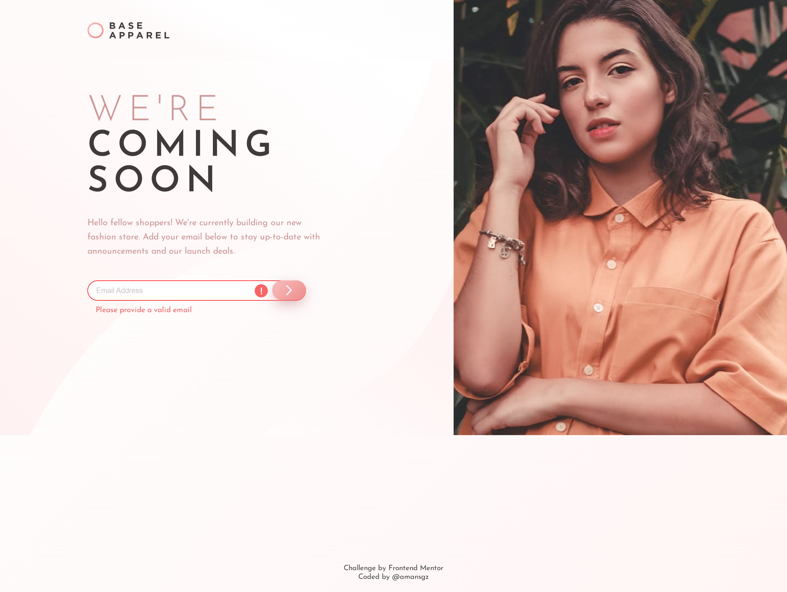

# 👩‍💻 Frontend Mentor - Base Apparel Coming Soon Page

[Frontend Mentor challenges](https://www.frontendmentor.io/) help you improve your coding skills by building realistic projects.

This is a solution for [Base Apparel Coming Soon challenge](https://www.frontendmentor.io/challenges/base-apparel-coming-soon-page-5d46b47f8db8a7063f9331a0)

## The challenge

The challenge is to build out this coming soon page and get it looking as close to the design as possible.

Users should be able to:

- View the optimal layout for the site depending on their device's screen size
- See hover states for all interactive elements on the page
- Receive an error message when the `form` is submitted if:
  - The `input` field is empty
  - The email address is not formatted correctly

## Built with

- Semantic HTML5 markup
- CSS custom properties
- Flexbox
- Mobile-first workflow

## Live site solution

[Live site](https://amansgz.github.io/css-base-apparel-coming-soon/) deployed with GitHub Pages.

## Author

- Frontend Mentor - [@amansgz](https://www.frontendmentor.io/profile/amansgz)